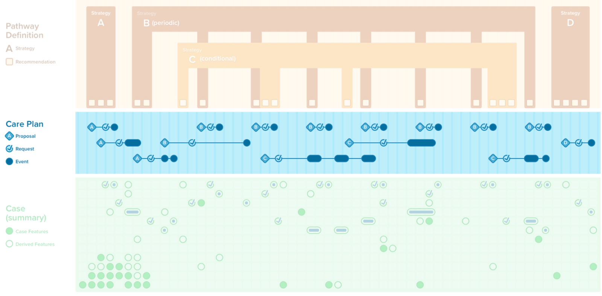
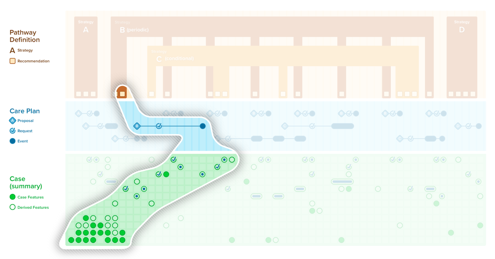

### **Care Plan**

A care plan can be conceptualized as the patient-specific or instantiated “plan” concretized against an individual case.  The Care Plan describes the intention of how one or more healthcare professionals intend to provide care for a specific patient, group, or community for a period of time, possibly limited to care for a specific condition or set of conditions.  In the CPG, the care plan is scoped to the condition(s), intervention(s), recommendation(s), and other relevant “plan” content in this limited context (e.g., contraindications, correlated orders and results such as drug levels, or other orders or fulfillments that must be considered in triggering, decision, or orchestration logic).

Covered in this Section:

*   Overview of the CPG Care Plan
*   Proposals
    *   CPGProposal as a Patient-specific CPGRecommendation
    *   Patient Information Supporting the Proposal
*   Requests
*   Events
*   Shared Care Plans

FIG. 75. The CPGCarePlan With its CPGProposals and resulting or related Requests and Events.

The CPGCarePlan is constrained to the set of proposals (i.e., patient-specific recommendations), clinical interventions (e.g., orders/ requests), or their fulfillments (e.g., events) scoped by a specific CPG.  This includes those related to the guideline recommendations, the strategies for combining guideline recommendations, the decision logic for each recommendation, the strategies for combining recommendations, and  how the overall guideline or pathway combines or orchestrates all of the recommendations and strategies in the context of a specific case (i.e., patient).  As described in the “Methodology” section, the CPGCarePlan is modeled as a profile on a [FHIR CarePlan Resource](https://www.hl7.org/fhir/careplan.html).

FIG. 76. The Care Plan consists of the patient-specific recommendations as [Proposals](http://hl7.org/fhir/codesystem-request-intent.html#request-intent-proposal), Requests that correspond (or are related) to the Proposals, and the corresponding or related Events.  Note that the Requests and Events are also referenced by the Case as CPGCaseFeatures.

**Proposal:**

A patient-specific recommendation, that has taken into account all the criteria in the computable decision logic and affords the ability for a care team member to make a request (order, prescription, schedule) is known as a Proposal.  Such a Request may be “being considered for a plan”, planned, proposed, requested, or performed within a clinical information system workflow.  In FHIR, this is modeled as the Request’s [Intent](http://hl7.org/fhir/codesystem-request-intent.html#4.3.14.226).  

“Being considered for a plan” means that the potential activity (see [FHIR Request pattern](http://hl7.org/fhir/request.html)) has not yet been fully evaluated.  “Planned” means that the activity or request is intended but has not yet entered the workflow.  “[Proposed](http://hl7.org/fhir/codesystem-request-intent.html#request-intent-proposal)” means that the activity or request has been suggested either by a decision support system or another care team member such as a consulting physician.  “Requested” means that the activity or request has been initiated by an authorized healthcare professional or care team member.  “Performed” means that the activity or request has reached a state of completion resulting in an event (see [FHIR Event pattern](http://hl7.org/fhir/event.html)).  Proposals carry sufficient information to initiate a Request.

Further tracking of the state of completion of an activity may be supported through the [FHIR Task Resource](https://www.hl7.org/fhir/task.html) which may be applied to a request as well as its resulting or related Events.  Tasks can further carry information about [Intent](http://hl7.org/fhir/valueset-task-intent.html) and can be used to address boundary issues related to workflow. See section on Workflow and Common Pathway <!-- link to 12.06 !--> for more details on the “workflow” as it related to Proposals, Requests, Events, and Tasks.

**CPGProposal as a Patient-specific CPGRecommendation**

A CPGProposal is a patient-specific instantiation of a CPGRecommendation.  As such, a CPGProposal carries forward much of the information content of the CPGRecommendation, including all of the necessary definition for the request such as attributes or parameters that have been defined explicitly or inferred through the various decision logic or other formal expressions of the CPGRecommendation or broader CPG.  Furthermore, a CPGProposal may similarly carry forward information specific to a CPGRecommendation, such as the narrative guideline recommendation and its reference or provenance to through an Evidence Resource, including directionality, strength of recommendation, and quality of evidence qualifiers, which themselves reference Evidence Resources and Evidence Variables.  Of note, information contained in evidence variables, such as formalizations of various PICOTS variables (i.e., population, intervention, comparator, outcomes, timing, and setting) may not only be used in the CPGRecommendation (i.e., semantics of request definition and decision logic), but may be used in end-user enablements (e.g., SMART-on-FHIR apps) to facilitate additional capabilities such as retrieving and displaying supplemental patient data (e.g., summary views) or for population-level aggregates for comparison (e.g., “patient-like-this” queries).

Further tracking of the state of completion of an activity may be supported through the [FHIR Task Resource](https://www.hl7.org/fhir/task.html) which may be applied to a request as well as its resulting or related Events.  Tasks can further carry information about [Intent](http://hl7.org/fhir/valueset-task-intent.html) and can be used to address boundary issues related to workflow.

**Patient Information Supporting the Proposal**

Patient-specific recommendations or proposals, and clinical decision support in general, have been shown to be more effective and beneficial when supported by recommendations-specific patient information.  In the 6S evidence pyramid described in the “Guideline Development Process” section, this is referred to as real-world evidence.  This patient-specific information often includes the pertinent information from the case that informs the decision(s) that the clinician must make with respect to the recommendation (e.g., representing indications for an intervention). This often includes the primitive and inferred data elements used in the decision logic for the recommendation.  It may address contextual historical information and clinical information related to the clinical and disease processes (i.e., clinicopathology directly related to the medical decision(s)) implicit in the recommendation and made explicit by the knowledge formalizations. It may also include pertinent information related to contraindications (i.e., reasons not to perform the recommended intervention), that are both relative and absolute, though most absolute contraindications are addressed directly in the formalized decision logic.

In the CPG, this supporting information is closely correlated with the CPGCaseFeatures used in the formalized decision logic for the CPGRecommendation, or some subset thereof, as well as other data elements may have been specified as required in the CPGRecommendation (i.e., as a scoped CPGCaseFeatureGroup or CPGCasePlanSummaryView).  These additional data elements (CPGCaseFeatures) may represent relevant historical or contextualizing information, the status or responses (CPGRequest, CPGEvents) of related CPGProposals, or even other CPGRecommendations not yet proposed, as well as relative or absolute contraindications for the CPGProposal.  In order to specify this information, a CPGRecommendation may include scoped definitions of CPGCaseFeatureGroups or CPGCasePlanSummaryViews.

FIG. 76. A CPG Recommendation with its scoped CPGCasePlanSummaryView.

**Request (as part of the CPGCarePlan)**

Requests encompasses all types of orders (e.g., original orders, filler representations of orders, reflex orders, etc.) as well as proposals/recommendations for action to occur, plans, scheduling, etc. Any sort of description of an activity that is desired where the description is specific to the subject of the activity and the approximate timing of the activity would be considered a request.  (see [FHIR Request Pattern](https://www.hl7.org/fhir/request.html)).  In the CPG-IG, a request may be the result of a proposal or may at least correlate to the proposed request; however, there may be other requests of interest to the scope of a specific CPG, in particular a CPGStrategy and/or CPGRecommendation, CPGCarePlan,  CPGCasePlanSummaryView,  CPGCaseSummary, or any of the numerous derived assets such as the CPGMetric, CPGMeasure, CPGeCaseReport, or CPGCasePlanProgressingNote.

Of note, a request is at the boundary between the care plan and the case (i.e., CPGCarePlan, CPGCase).  While an order may not necessarily represent something that was actually done to the patient (e.g., a medication administration as an ‘exposure’), there are several reasons to consider it as part of the case (i.e., patient specific information) as well as the care plan. First of all, it is not uncommon for an order or prescription (i.e., request) to be the only evidence that something was done for the patient without any data element in the clinical information system (e.g., EHR) that represents or documents the resulting event.  Secondly, requests (e.g., orders, prescriptions, scheduling services) conveys strong intent and timing information about the patient’s clinical state and/or interventions.  The approach the CPG-IG takes in addressing requests is to consider them as both part of the CPGCarePlan as well as a CPGCaseFeature- it plays dual roles and is referenced by each.

**Event (as part of the CPGCarePlan)**

Events are descriptions of activities that have taken place or that are currently taking place. This includes resources that primarily describe the result of a request (e.g., activity) or what was found (e.g., a condition or observation). Examples include medication dispense or administrations, procedures, encounters, questionnaire responses, observations, diagnostic report, clinical document (i.e., FHIR Composition), and many other found in the [FHIR Event pattern](https://www.hl7.org/fhir/event.html#mappings).  

Similar to a request, an event also may be at the boundary between the care plan in the case (i.e., CPGCarePlan, CPGCase).  However, only events that correspond to the fulfillment of a request belong in the care plan.  These Events also serve as CPGCaseFeatures in the CPGCase. Boundary issues for dealing with events that belong to both the CPGCarePlan and CPGCase are discussed in the section on Separating and Defining Case, Plan, and Workflow. <!-- link to 12.06 !-->

**Shared Care Plan**

For more information on a “Shared Care Plan”, please refer to the [Multiple Chronic Conditions Dynamic Electronic Care Plan FHIR IG](https://confluence.hl7.org/display/PC/Multiple+Chronic+Conditions+Dynamic+Electronic+Care+Plan+FHIR+IG).  Shared Care Plans are but one means of interelating and interoperating between more than one CPG.
