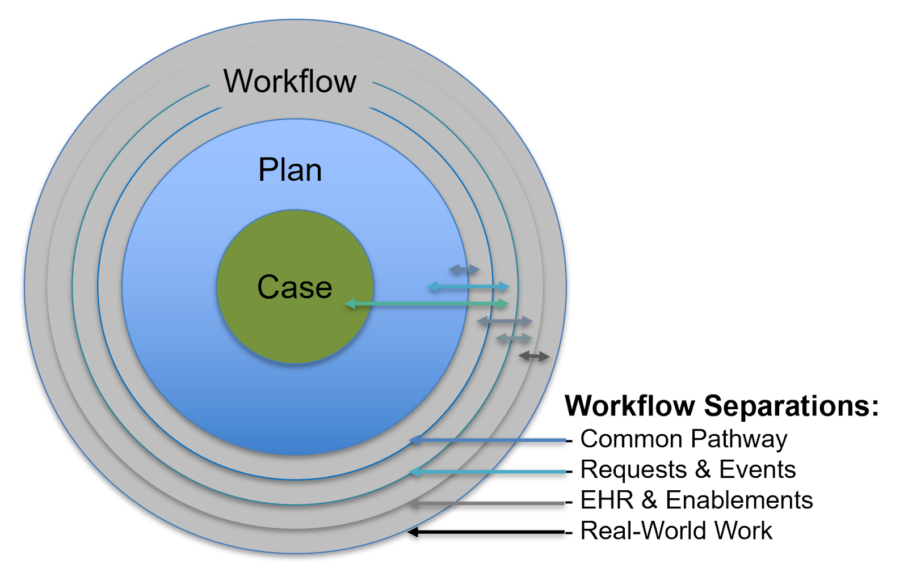
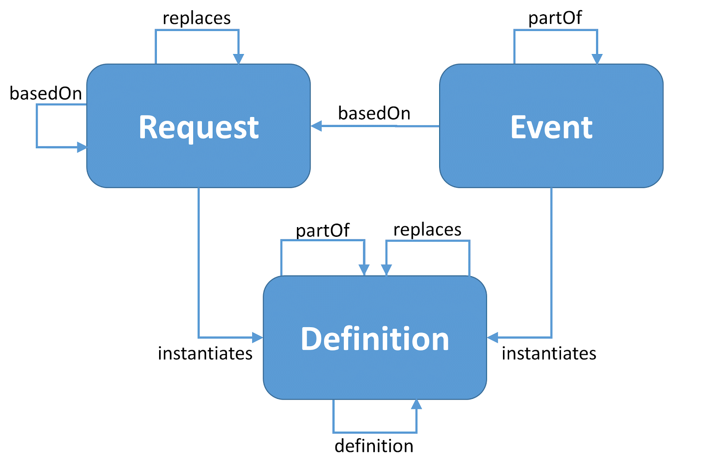
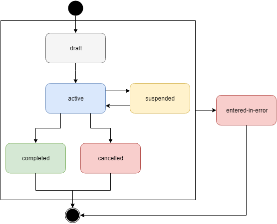

# **Workflow and Common Pathway**

Covered in this section:

*   Overview of Workflow in the CPG
*   Common Pathway
*   Clinical Information System (EHR) Workflow
    *   Request pattern and status
    *   Event pattern and status
    *   Tasks
*   Workflow Enablements and Interventions (Cognitive and Decision Support)

The workflow separation, as discussed in the section on Separations of Concerns in the CPG <!-- link to - 12.01 !-->, is critical to address as a separation from the Case and the Plan as well as have means to relate to from the Plan and patient-specific Care Plan without conflating what is done for the patient with how it gets done (in local implementations).  Workflow directly relates to the Case in that influences what is known about the patient (i.e., Events) and done for the patient (i.e., Requests) as well as when, by whom, where, and through what means.  Thus, some aspects of local workflow can be inferred from information in the Case (e.g., CPGCaseFeatures).

Workflow itself may be further separated into generalized abstractions of workflow across settings and the real-world care delivery activities in those activities that are carried out in the context of clinical information systems (e.g., EHRs).  The Common Pathway addresses higher level abstractions on care settings, clinical activities, and healthcare professional roles.  Many implications of localized, real-world workflow are reflected in the information carried in FHIR Resources and related modules and patterns that are addressed in the [FHIR Workflow Module](https://www.hl7.org/fhir/workflow-module.html) including the [FHIR Workflow Description](http://hl7.org/fhir/workflow.html#12.5), and its workflow resource patterns for Definitions, Requests, and Events.  The [Clinical Reasoning Module](https://www.hl7.org/fhir/clinicalreasoning-module.html) addresses the type of workflow interventions and/or enablements through which guidance is delivered into the care delivery process, such as the cardinal types of CDS (ref<!-- Osheroff, J. A. (2012). Improving outcomes with clinical decision support: an implementer's guide. HIMSS. !-->), described in part in its [Common Use Cases](https://www.hl7.org/fhir/clinicalreasoning-module.html#uses).
Osheroff, J. A. (2012). Improving outcomes with clinical decision support: an implementer's guide. HIMSS.

FIG. 77.  The Case, Plan, Workflow separations and further separations within workflow and how each relates to the Case and/or Plan.  The Common Pathway provides generalized abstractions of settings, activities, and healthcare professional roles can be referenced from within the Plan.  Requests and Events, and in their various statuses represent information about the Plan (including the patient-specific Care Plan) and Case, carry information about the clinical information system workflow and into the clinical information system workflow.  The clinical information systems (EHR and Enablements) convey information into the workflow from the Case and Plan (including the patient-specific Care Plan) as well as afford a means for interactions with end-users (e.g., healthcare professionals, patients, caregivers, quality professionals, researchers).

**Common Pathway** <!-- Needs some work. Conflates Settings and Activities; only addresses Ambulatory !-->

The common pathway provides an abstract or generalized description of the overall process of care delivery that relates to care settings and high-level care activities.  The common processes identified in this implementation guide are based on surveys of guideline content, both in the examples used in this guide, as well as other guideline content from various clinical domains and guideline authors.

The result is the definition of a [Common Pathway](http://build.fhir.org/ig/HL7/cqf-recommendations/common-pathway.html) that is intended to be applicable in any guideline-based care content, but not a specific localization or implementation thereof.  Using this common pathway, content can indicate where in the overall process of care delivery a given recommendation or intervention should occur.  

Content conforming to this implementation guide SHALL identify processes using the [Common Processes code system](http://build.fhir.org/ig/HL7/cqf-recommendations/CodeSystem-cpg-common-process.html).

**Use of Common Pathway in Localization**

Some local implementations of Pathways have used a similar approach using a work domain ontology to create a separation between the high-level descriptions of clinical workflow and the details of numerous, varying distinct interventions or enablements of specific workflows across clinical information systems, roles, and specific settings (e.g., units within the same hospital).  A work domain ontology is a ‘shareable conceptualization’ of a setting where actual work occurs such that it can be discussed, described, analyzed, modelled, governed, and supported (e.g. with information and knowledge management tools) effectively- in part, through use of consistent, common, and sufficiently detailed vocabulary.  Where available, publicly available standard vocabularies and ontologies were used to describe settings, roles, activities, and information system components (including user interface and data elements).  

In these contexts, a work domain ontology was used as a means to normalize the various distinct findings from the numerous task or workflow elicitation and analysis methods and efforts (ref <!-- MAyo SSS and ROOT !-->), that can then be used to related to guideline-directed cognitive and decision support enablements (ref).  Generalizations can be further specified or localized using site-specific logic including for specific triggering events and interventions.  Further details of localization are site, vendor, and mechanism of integration specific and are currently beyond the scope of this implementation guide.

**Clinical Information System (EHR) Workflow**

Tracking of workflow as performed in the clinical information system (i.e. EHR) is described in the [FHIR Workflow Description](https://www.hl7.org/fhir/workflow.html).  This topic is covered in depth in the [FHIR Workflow Module](https://www.hl7.org/fhir/workflow-module.html).  This implementation guide briefly describes its implications for the CPG.

The things being done in the clinical information system are called activities and are defined using the [FHIR ActivityDefinition resource](http://www.hl7.org/fhir/activitydefinition.html).  The ActivityDefinition provides the description or definition of an action to be performed and is [applied to a FHIR resource](http://www.hl7.org/fhir/activitydefinition.html#12.17.3.3) following the Request and/or Event patterns.  The workflow relationships of FHIR resource patterns involved in Activities including Definitions, Requests, and Events is described [here](http://hl7.org/fhir/workflow.html#respatterns). The FHIR Request pattern has a [status](https://www.hl7.org/fhir/request-definitions.html#Request.status) that uses a defined [value set](http://hl7.org/fhir/valueset-request-status.html).  Request Status includes: draft, active, on-hold, revoked, completed, entered-in-error, and unknown that can be described as a [state machine](https://www.hl7.org/fhir/request.html#statemachine).  The [FHIR Event pattern](https://www.hl7.org/fhir/event.html) likewise has its own [status](https://www.hl7.org/fhir/event-definitions.html#Event.status) that uses a scoped [value set](https://www.hl7.org/fhir/valueset-event-status.html) that can be described as a specialized [state machine](https://www.hl7.org/fhir/event.html#statemachine).  THe Event status includes: preparation, in-progress, not-done, suspended, aborted, completed, entered-in-error, and unknown.  These patterns are described in the figures below.

FIG. 78. Description of the Resource patterns and their interrelationships from [Workflow Resource Relationships](https://www.hl7.org/fhir/workflow.html#relationships) in the [FHIR Workflow Description](https://www.hl7.org/fhir/workflow.html).

FIG. 79. Depiction of the FHIR Request status as a [state machine](https://www.hl7.org/fhir/request.html#statemachine) from the FHIR Request pattern.

FIG. 80. Depiction of the FHIR Event status as a [state machine](https://www.hl7.org/fhir/event.html#statemachine) from the FHIR Event pattern.

**Using FHIR Tasks with Requests and Events**

Further tracking of the state of completion of an activity may be supported through the [FHIR Task Resource](https://www.hl7.org/fhir/task.html) which may be applied to a Request as well as its resulting or related Events.  A Task resource describes an activity that can be performed and tracks the state of completion of that activity. It is a representation that an activity should be or has been initiated, and eventually, represents the successful or unsuccessful completion of that activity.

Tasks are related to Requests in that tasks can both request and track the fulfillment of a request. In some cases, fulfillment may also result in the creation of sub-tasks. Requests do not track their own fulfillment - i.e. requested/accepted/in-progress. This is managed through Task. The status of a request only reflects the status of the "authorization/intention", not how the request is being executed or not. It is possible for multiple tasks to be associated with the fulfillment of a single Request.

Tasks are related to Events in that events can be performed in fulfillment of a task and performing an event may involve the execution of one or more tasks. Events do not track the fulfillment of any requests they may be associated with. Tracking of fulfillment is managed through the Task resource.  

The [FHIR ](https://www.hl7.org/fhir/event.html)Task resource also has its own [status](https://www.hl7.org/fhir/task-definitions.html#Task.status) that uses a scoped [value set](https://www.hl7.org/fhir/valueset-task-status.html) that can be described as a specialized [state machine](https://www.hl7.org/fhir/task.html#statemachine).  Tasks can further carry information about [Intent](https://www.hl7.org/fhir/task-definitions.html#Task.intent) that uses a scoped [value set](http://hl7.org/fhir/valueset-task-intent.html) including: plan, proposal, order, original-order, reflex-order, filler-order, instance-order, optional, and unknown.  Task Status and Intent can be used to address boundary issues related to workflow in a CPG.  Boundaries and relationships related to Taks and their use with Requests and Events are further discussed in the [Task resource section on Boundaries and Relationships](https://www.hl7.org/fhir/task.html#bnr).

FIG. 81. Depiction of the FHIR Task status as a [state machine](https://www.hl7.org/fhir/task.html#statemachine) from the FHIR Task resource.

**Workflow Enablements and Interventions (Cognitive and Decision Support)**

As described above, much information about clinical information system workflow may be carried in the FHIR Request and Event resources that interoperate between clinical information systems and/or decision-support services and apps (e.g., [CDSHook](https://cds-hooks.hl7.org/), [SMART-on-FHIR](http://www.hl7.org/fhir/smart-app-launch/) apps).  And the Task resource describes activities that can be performed in these systems and can track the state of completion of these activities.  The CPG recommendations and their associated requests and events are such activities that can be directed or enabled through various workflow interventions.

The [Clinical Reasoning Module](https://www.hl7.org/fhir/clinicalreasoning-module.html) addresses the type of workflow interventions and/or enablements through which guidance is delivered into the care delivery process, such as the cardinal types of CDS (ref) (e.g., alerts and reminders, order sets, documentation templates, smart forms, information summaries- often problem or intervention oriented), quality or performance measurement or patient-level metrics or indicators, or more advanced forms of workflow or cognitive support delivered via apps adjacent or supplemental to clinical information systems (e.g., SMART-on-FHIR Apps).  Further considerations for these interventions or enablement may include the “CDS five rights”: the right information; to the right person; in the right intervention format; through the right channel; and at the right time in the workflow (ref <!-- Campbell, R. J. (2013). The five rights of clinical decision support: CDS tools helpful for meeting meaningful use. Journal of AHIMA, 84(10), 42-47. !-->).

In the CPG implementation guide, these interventions and enablement are recognized to be downstream consumers of the knowledge content within the CPG with considerations being made for critical content or information requirements thereof. Many of these interventions or enablements have their own standard and/or implementation guides ([CDS-Hooks](https://cds-hooks.hl7.org/), [SMART-on-FHIR](http://www.hl7.org/fhir/smart-app-launch/), [Measure IG](http://hl7.org/fhir/us/cqfmeasures/2019May/index.html), [eCaseReport-IG](http://hl7.org/fhir/uv/ecr/2018Jan/index.html)).  While the CPG-IG intentionally does not directly address details of localized clinical workflow, it must and does provide affordances conveying critical content for downstream consumers including “the Common Pathway” (i.e., an abstraction of high-level clinical workflows), shared information (e.g., Requests and Events as CPGCaseFeatures), and reuse of the same standards for clinical information system activities (e.g., requests, events, and their lifecycle including their status and tasks) as well as interventions (e.g., forms, CDSHooks, etc.).
